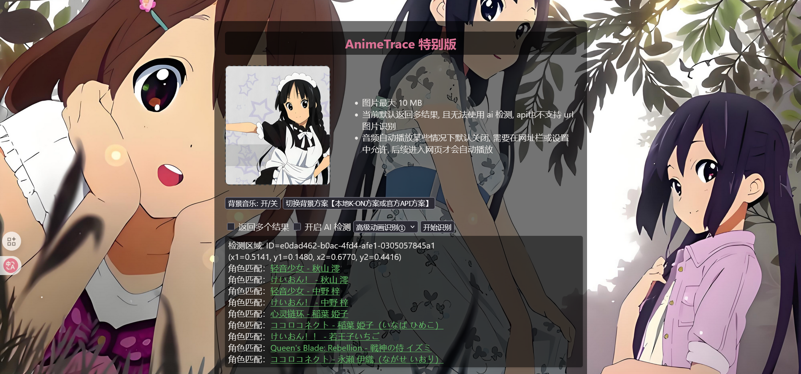
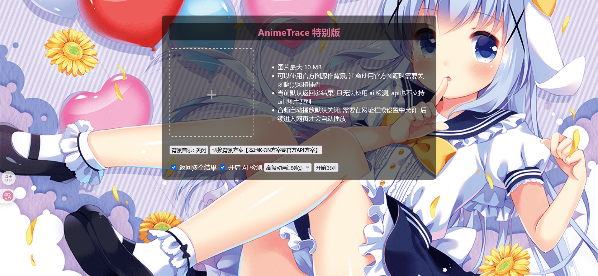

# AnimeTrace_KONver(K-ON version) 
AnimeTrace的轻音少女版本
## 介绍
>官方网站可能在某些浏览器的某些版本，或者没有正常设置的电脑，无法正常运行，因此调用AnimeTrace官方的API接口制作该版本，并添加了一些轻音少女的要素在内，同时具备官网的一部分功能，四种模型可以正常使用。 

  
  

## 环境
+ 现代浏览器（firefox，chrome，edge等）（必需）
+ python环境，并安装 PIL 库（方括号为可选，如果国内速度慢的话）（非必需）
```
pip install [-i https://pypi.tuna.tsinghua.edu.cn/simple] pillow
```
## 使用方法
+ 方法一 打包整个文件下载后，运行 animetrace.html
```
https://github.com/JustbeWater/AnimeTrace_KONver/archive/refs/heads/main.zip
```
+ 方法二 克隆仓库后运行animetrace.html
```
git clone https://github.com/JustbeWater/AnimeTrace_KONver.git
```
## 功能 
>1. 含有两个高级动画模型，一个普通动画模型，以及 Galgame 识别模型
>2. 每分钟更换一次背景图片，也可以通过刷新界面更换壁纸，可以自己往bg文件夹里存放壁纸，然后使用 change.py，删除 image()的注释，并注释掉 music() ，运行change.py后修改 html 文件中的 max (图片数量)，即可扩展本地壁纸
>3. 可以自己往 music 文件夹中添加相同格式和后缀的音频文件，然后使用 change.py，删除 music() 注释，并注释掉 image()，运行change.py后修改 html 文件中的 totalSongs (音频数量)，即可扩展本地音频歌单
## 官方地址
+ [网站网址一](https://www.animetrace.com/)
+ [网站网址二](https://ai.animedb.cn/)
